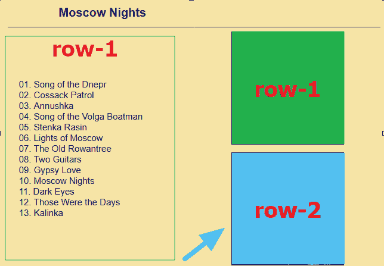
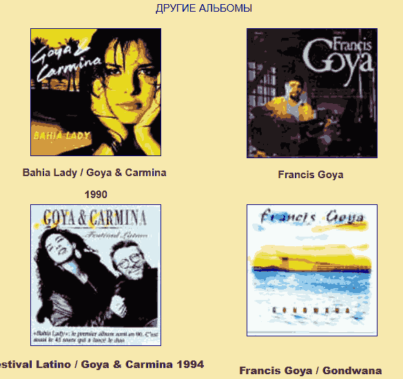
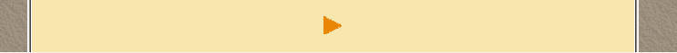
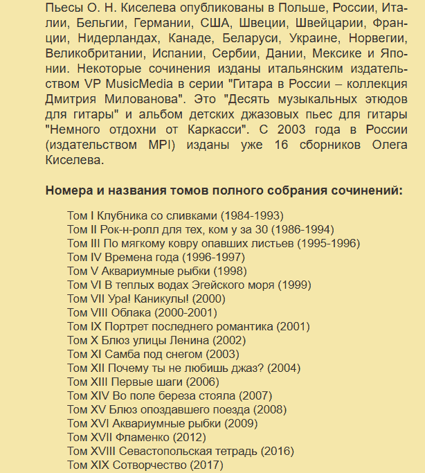
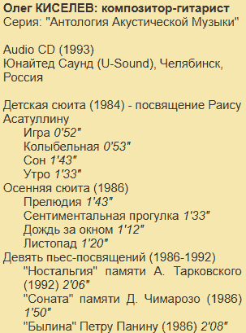

# Различия между reference файлами и результатами конвертирования, их причины и решения / правила

## Общие правила

### Обработка ссылок
ко всем относительным (не абсолютным) ссылкам, которые начинаются, а точне точнее в пути своем не ведут на следующие корневые каталоги:
articles/..
music/..
photo/..
use/..
а например на
main/
magazine/
fest/
и другим:
должен добавляться в начало пути "/../"
например
"main/kniga_mg.jpg" -> "/../main/kniga_mg.jpg"
при этом если ".." уже есть, например "../main/previous.gif" или "/../main/previous.gif" то ссылка остается без изменений.
ссылки типа:
"articles/geyzel/img_07.jpg" -> без изменений, начинается с "articles"
"/music/tab/asvbret.txt" -> без изменений, начинается с "music" (слеш в начале не учитываем)

### news.htm
Первый абзац, в оригинале никак не выделяется в reference это человеческое решение - добавлен для красоты, абзацы что выделены :::lead начинаются с красивой большой буквы и более наглядны.
'''md
::: lead
'''
ближе к концу страницы идет текст: "Подведены итоги *III Международного конкурса гитаристов имени Александра Фраучи* (17–23 ноября 2013 г.) в Москве:"
и далее html:
'''htm

Подведены итоги <i>III Международного конкурса гитаристов имени Александра Фраучи</i> (17–23 ноября 2013 г.) в Москве: 
		&ensp;&ensp;1-я премия и приз зрительских симпатий от фирмы Savarez – 
		<b>Артём Дервоед</b> (Россия, Москва), 
		&ensp;&ensp;2-я премия – <b>Антон Баранов</b> (Россия, Санкт-Петербург), 
		&ensp;&ensp;3-я премия – <b>Юрий Алешников</b> (Россия, Белгород) и 
		<b>Марк Топчий</b> (Украина, Киев). 
		&ensp;&ensp;диплом за участие в финальном туре – <b>Дмитрий Загуменников</b> (Россия / Австрия, Грац)

'''
тут перечисление призовых мест каждое начинается с  новой строки, весь блок выделен как 
 параграф и далее используются   + еще и отступы &ensp;&ensp;&ensp;
я отформатировал этот блок как список и добавил "-" что бы получилось так:

'''md
- 1-я премия и приз зрительских симпатий от фирмы Savarez – **Артём Дервоед**  (Россия, Москва),
- 2-я премия – **Антон Баранов** (Россия, Санкт-Петербург),
- 3-я премия – **Юрий Алешников** (Россия, Белгород) и **Марк Топчий** (Украина, Киев).
'''
и тд.
конвертор все объединяет в 1 линию.

следующий блок в этом htm - те же правила.

### goya2.htm

В оригинальном htm текст с ошибкой:
'''htm
- [Галерея инструментальной музыки. Francis Goya\
  ](#26)
'''
тут можно догадаться, что это ссылка, которая всегда идет в 1 строку и имеет формат [видимое-название](ссылка)
разбиение на 2 строки - для них не имеет смысла, я исправл
'''htm
- [Галерея инструментальной музыки. Francis Goya](#26)
'''
цель конвертора не 1 в 1 конвертировать, а конвертировать и исправлять ошибки.

еще одна ошибка похожего рода, в одном из альбомов перечисляются трэки
все пронумерованы, выделены как параграф и идут по-счету
'''md
- 01\. (Everything I Do) I Do It For You
- 02\. Melodia
- 03\. Sacrifice
- 04\. Be
- 05\. Cry For Help
- 06\. Send Me An Angel
- 07\. Natacha
- 08\. Sound Of Silence
'''
в последнем 9-ом ошибка форматирования (в оригинальном htm) и он идет так:
'''md
09\. Promise Me
''' 
и еще и отделен от остальных пустой строкой.. Человеческая ошибка , присутствует в оригинале - я исправил. Было бы неплохо если бы и конвертор так умел, хотя тут нужна эвристика.

Следующая различие, не реальная проблема, а просто разные подходы в альбоме "Francis Goya Plays His Favourite Hits"
там 2 текста друг за другом выровнены по центру, я сэкономил и использовал 1 "::: align" вместо двух, это допускается:
у меня:
::: align
position: center
**Francis Goya Plays His Favourite Hits**

**Vol. 2**
:::
'''
у тебя
::: align
position: center
**Francis Goya Plays His Favourite Hits**

:::
::: align
position: center

**Vol. 2**
:::
:::
'''
такая же ситуация и тут (я объединил 2 align блока в 1 - допускается):
'''md
::: align
position: center

**This Is Francis Goya**
1988

:::
'''

Реальная серьезная проблема с пониманием многоколоночного layout под названием альбома "Moscow Nights":
там реально запутанная ситуация, вот html:
'''htm
<tr>
  <td width="50%" valign="middle" rowspan="2">
    
01. Song of the Dnepr 
      02. Cossack Patrol 
      03. Annushka 
      04. Song of the Volga Boatman 
      05. Stenka Rasin 
      06. Lights of Moscow 
      ... 
  
</td>
  <td width="50%" valign="top">
    

</td>
</tr>
<tr>
  <td width="50%" valign="top">
    

</td>
</tr>
'''
совет: используй встроенный browser tool, что бы проанализировать Layout и расположение элементов
по факту 2 row и в первой row: 1) текст и картинка
и второй row) только картинка,
в 1-ой row - каждый столбец занимает 50% ширины экрана, текст длинный и занимает 50% ширины и всю высоту, располагается слева, картинка - раполагается справа и занимает оставшуюся ширину, центрируется по верху "valign="top">", но лишь половину высоты, под ней остается пространство
в ASCII получается так
XX
X0
где "X" - пространство занятое 1-ой row, a 0 - не занятое.
и вторая row, у которой тоже  valign="top"> и width="50%" размещается на этом незанятом пространстве и визуально выглядит, что обе картинки в одной колонке и относятся к тексту слева.
смотри скриншот:

сложный layout, тут нужно глубокое понимание как browser рендерит html.
markdown таких хитростей не поддерживает и поэтому единственный способ сделать layout похожим на оригинальный и отобразить обе картинки справа - это отобразить их друг под другом в одной правой колонке, что я сделал в reference.
вот так
'''md
::: columns

::: column
<список песен>
::: column

::: column

::: image
src: photo/g/goya/goya_moscow1.jpg
position: center
size: medium
:::

::: image
src: photo/g/goya/goya_moscow3a.jpg
position: center
size: medium
:::

:::
:::
'''

в самом конце после заголовка "ДРУГИЕ АЛЬБОМЫ" htm идут картинки с альбомами:
и тут уже никаких хитростей идет простая таблица в 2 колонки:
'''md
<tr>
    <td width="50%" class="t" valign="top">
      

      

<b>
      <a name="20">Bahia Lady / Goya &amp; Carmina&nbsp;</a></b>
      

<b>1990</b>
    
</td>
    <td width="50%" class="t" valign="top">
      

      

<b><a name="21">Francis Goya</a>
      
      </b>
    
</td>
  </tr>
'''
и рендерер почему то не определяет этот 2-колончатый layout.
Cамым логичным было бы представить это в markdown используя:
'''md
::: images
columns: 2
'''
т.е. картинки будут идти в 2 колонки , как в оригинале

### new_karta.htm

Здесь 1-ый параграф с текстом начинающийся словами: "Поскольку биографические страницы сайта обновляются" заключен в таблицу с включенным border и указанным цветом, а именно :
'''html
<table border="1" width="90%" cellpadding="2" cellspacing="0" bgcolor="#EBDCBC">
  <tbody><tr>
    <td width="100%" class="t1">
      
текст

    </td>
  </tr>
</tbody></table>
'''
поэтому такой текст я тоже выделил и поместил в самую близкую по цвету рамку :

'''md
::: frame
frame: white

Поскольку биографические страницы сайта обновляются значительно чаще, новые пополнения иногда могут отображаться на 'аудио-карте' с некоторым запозданием.

:::
'''
далее проблемы с таблицами, 1-ая конвертируется правильно, 
а вторая под надписью "Абреу Сержиу и Эдуарду" не распознается.
html выглядит так:
'''html
<table border="0" width="85%" cellspacing="0" cellpadding="0">
    <tbody><tr>
      <td width="67%" class="l">El Puerto, da Suite Iberia (arr. Sergio Abreu, Duo)&nbsp;</td>
      <td width="8%" class="l"><a href="pages/music/wma/abreuduo_albeniz.wma"><u>WMA</u></a></td>
      <td width="12%" align="center"></td>
      <td width="12%" align="center"></td>
    </tr>
  </tbody></table>
'''
как видишь это обычная таблица, без заголовка, в которой 4 столбца, но  последние 2 пустые и поэтому их стоит отфильтровать. Итог должен выглядеть так:
'''md
| | 🔗 |
| - | - |
| El Puerto, da Suite Iberia (arr. Sergio Abreu, Duo) | [WMA](pages/music/wma/abreuduo_albeniz.wma) |
'''

после "*Алаис* Хуан" идет правильная таблица, но в ней названия всех столбцов пустые, это не критично, но для столбцов со ссылками лучше было бы так:
'''md
| | 🔗 | 🔗 |
'''

🔗 - код &#128279;
т.е. любой столбец где есть какие-то ссылки, что бы не включать эвристику и не определять просто именовать так: "&#128279;" или  "🔗"

В других таблицах, после заголовков "Альбенис Исаак", "Армик", "Барриос Мангори Агустин" у тебя в правилах есть некий алгоритм, что пытается определить содержимое столбца , но делает это неточно для столбцов со смешанным содержанием.
Например определяет столбец как MIDI, хотя там есть файлы WMA.
Что бы упростить эвристику и алгоритмы просто именую столбцы так "&#128279;" или  "🔗" , что означает "абстрактное" ссылка

Далее после заголовка / текста: "Барруэко Мануэль" конвертор снова не смог определить / распознать таблицу:
вот html:
'''html
<table border="0" width="85%">
    <tbody><tr>
      <td width="90%" class="l"> Heitor Villa-Lobos - <i>Prelude No 3 in A Minor</i></td>
      <td width="10%" align="center">
        <a href="pages/music/wma/lobos_prelud3.wma"><u>WMA</u></a>
      </td>
    </tr>
    <tr>
      <td width="90%" class="l"> &nbsp;</td>
      <td width="10%" align="center">&nbsp;</td>
    </tr>
  </tbody></table>
'''
снова достаточно простая таблица из одного row. почему-то конвертор ломается именно на таблицах состоящих из одной записи : one row
должно получиться:
'''md
| | 🔗 |
| - | - |
| Heitor Villa-Lobos - *Prelude No 3 in A Minor* | [WMA](pages/music/wma/lobos_prelud3.wma) |
'''

Далее проблема с мини-изображением / иконкой, что является еще и ссылкой.
В markdown "/mini_images_to_md_guide.md" документе описано, что нужно с ними делать
конвертор сгенерировал:
'''md
::: image
src: main/next.gif
position: center
size: small
link: /#/karta2
'''
а должно быть так:
'''md
::: align
position: center

[&#9654;](/#/karta2)

:::
'''
выглядит это так:

маленькая иконка со ссылкой и лучший способ это сделать в Md просто использовать линк, а не вставлять "::: image" со ссылкой, тэг "::: image" увеличивает эту иконку на половину ширины страницы и получается очень некрасиво.
а "&#9654;" как раз символ, что является эквивалентом этой картинки.

### kiselev.htm

после заголовка "Номера и названия томов полного собрания сочинений:"
идет большой однотипный пронумерованный римскими цифрами список сочинений.
Выглядит это так:

Этот список не только выделен более мелким шрифтом , чем остальной текст, но имеет значительный отступ по левому краю.
По этому изменившемуся отступу и другому font style / size можно определить, что текст особенный и нуждается в выделении.

для такого списка (отступ слева, мелкий шрифт, нумерация, однотипные строки) я решил, что самое логичное выделить его как список "-" 
и сделал так:
'''md
- Том I Клубника со сливками (1984-1993)\
- Том II Рок-н-ролл для тех, ком у за 30 (1986-1994)\
- Том III По мягкому ковру опавших листьев (1995-1996)\
- Том IV Времена года (1996-1997)\
- Том V Аквариумные рыбки (1998)\
..и так далее
'''
далее идут похожие блоки, с отступами по левому краю, смотри скриншот

их я тоже выделил как списки (чем они и являются, если проанализируешь их названия/контекст)
в reference варианте выглядит это так:
'''md
**Олег КИСЕЛЕВ: композитор-гитарист**\
Серия: "Антология Акустической Музыки"

Audio CD (1993)\
Юнайтед Саунд (U-Sound), Челябинск, Россия

Детская сюита (1984) - посвящение Раису Асатуллину

- Игра *0'52"*
- Колыбельная *0'53"*
- Сон *1'43"*
- Утро *1'33"*

Осенняя сюита (1986)

- Прелюдия *1'43"*
- Сентиментальная прогулка *1'33"*
- Дождь за окном *1'12"*
- Листопад *1'20"*
'''

нужны ли "\" в конце, я не знаю, у тебя они есть
'''md
Игра *0'52"*\
Колыбельная *0'53"*\
Сон *1'43"*\
Утро *1'33"*
'''
если необходимо - могу их добавить в reference.

после заголовка "## ПЯТЬ СЮИТ ОЛЕГА КИСЕЛЕВА" идет таблица, ты правильно определил название 2-ой колонки, но как я уже писал - автоопределение не всегда работает и  лучше использовать стандартную иконку ссылки (&#128279;")

то есть вместо "| | MP3 |" -> "| | &#128279; |"

таблица показана верно за исключением последнего 3-го столбца. Он всегда пустой, а поэтому не нужен.
Введи такое правило, проверять все row / Записи в 1-ом одном и том же столбце и  если все пустые (или прочерки), то такой column можно удалить.

в самом конце перед текстом "Олег Киселев: [Oleg.Kiselev@list.ru](mailto:Oleg.Kiselev@list.ru)" стоит такая длинная строка: "\-------------------------\"
это псевдоразделитель страницы, ее нужно заменить на валидный "---", стандартный для markdown

вообще любые длинные странные разделители , например такой "-----------------------------------------------------------------------------------------" это очевидно разделители страницы и их нужно заменять на "---"

см. так же предыдущий анализ
analyze.md