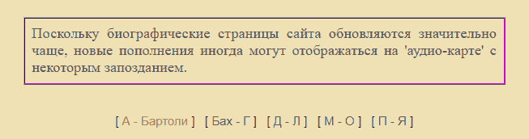
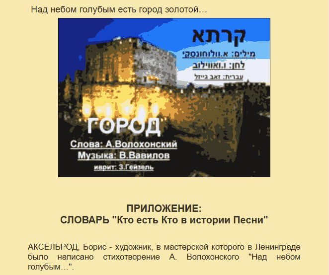
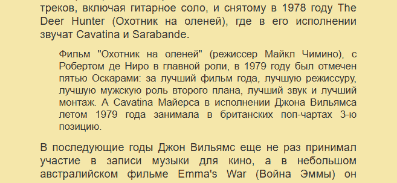
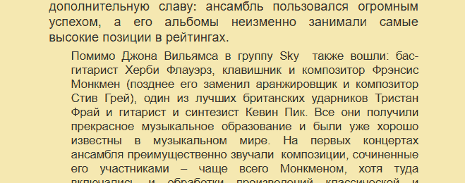
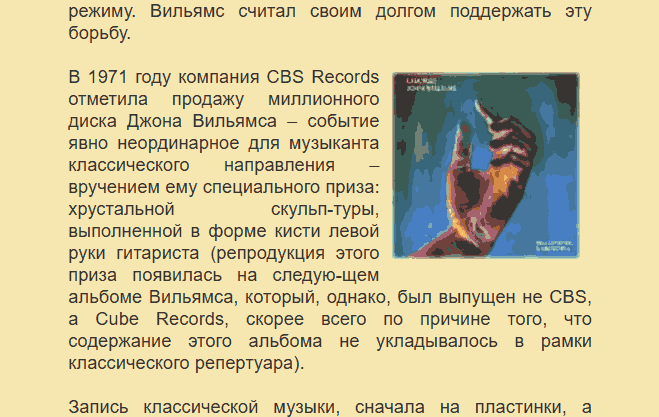

# Различия между reference файлами и результатами конвертирования, их причины и решения / правила

## Общие правила

### pavlov_azancheev.htm
после текста "Владимир МАРКУШЕВИЧ"
идет текст "М.ПАВЛОВ-АЗАНЧЕЕВ (1888-1963)." он выделен "<b>...</b>" как bold,
потом идет перенос строки , отступ пробелами и текст "(Краткая биография, нотное наследие, первые исполнители, неизвестные письма и документы)."

конверто делает все одним заголовком "##":
"## М.ПАВЛОВ-АЗАНЧЕЕВ (1888-1963). (Краткая биография, нотное наследие, первые исполнители, неизвестные письма и документы)."

1-ое критическое замечание , заголовки не должны быть слишком длинными - поэтому это идея плохая
2-ое замечание теряется визуальное оформление, стиль.. жирный текст по центру на одной стороке, обычный текст на следующей строке по центру
заголовки - всегда выровнены по левому краю и такое решение считаю не оптимальным.
Лучше сделать как в reference:
'''md
::: align
position: center

**М.ПАВЛОВ-АЗАНЧЕЕВ (1888-1963).**\
(Краткая биография, нотное наследие, первые исполнители, неизвестные письма и документы).
:::
'''
Тогда это точное соответствие оригиналу.

далее идет текст выровненный по правому краю:
"Я уважаемый Михаил Фёдорович, оптимист! ..."

В оригинале он italic, но по-смыслу содержанию это небольшой блок текста заключенный в кавычки, после которого в скобках в последней строке идет имя автора т.е. по смыслу это цитата.
Поэтому тут оба варианта одинаково верны и хороши - выбирай тот, который более гармонично вписывается в текущие правила и не противоречит другим правилам.
насчет "\" в конце каждой строки - смотри как правильнее по формату и спецификации, я их поставл на угад и не знаю какой вариант верный.

### new_lagq2.htm
тут все верно, кроме того, что последний блок 3 текста должны быть выровнены посередине.
по html это совршенно четко видно:
'''md
<td width="100%" align="center" colspan="2">
        
<b>T</b>he
        Best of the L.A.G.Q

        
<i>Music
        by:&nbsp;</i>

        
Copland
        - Basie - Tchaikovsky -&nbsp; Falla - Sousa - Warlock - Traditional -
        Boccherini - Morley - Gabrieli - Praetorius - Bach - Debussy - Main
        Street Electrical Parade

</td>
''' (стоит align="center")

### new_dyens.htm
Всего 1 проблема в таблице: "Tango En Skaï", "Valse En Skaï", "Libra Sonatine" все выделены "_" (italic)
в html за это отвечает .l class:
'''htm

Tango En Skaï

'''
где
'''css
.l {
    font-family: Arial Narrow;
    font-size: 10pt;
    color: #800080;
    font-style: italic;
}

'''

### jovicic.htm
Первый абзац / блок и в слове "успе-хов" не убран "-"

Ближе к концу страницы , после заголовка "Produkcija Gramofonskih Ploca Radio Televizije Srbije - RTS RECORDS\" + "CD 430916"
идет однотипный список - исполнителей и прозиведений и в конце каждой строки "\"
в Оригинальном htm не выделяется - я посчитал нужным выделить как список с помощью "-" в начале. Чисто человеческое дизайнерское решение.

### authors.htm
В блоках начинающихся с "ТАВРОВСКИЙ Виктор Владимирович" и "ТАВРОВСКИЙ Александр Викторович" проблемы с объединением переносов.
Неправильно написаны: "мар-кетолог", "Информационно-аналити-ческого", "под-держанию", "компью-терных", "Штут-гарте", "инфор-мационную", "програм-мную"
и в названии ссылки убран дефис (критически): [www.abcguitars.com] (должно быть [www.abc-guitars.com])

### new_kolpakov.htm
в таблице
'''htm
<table border="0" width="40%" cellspacing="0" cellpadding="0">
    <tbody><tr>
      <td width="50%">
        
Венгерка
</td>
      <td width="25%" align="center">
        
<a href="music/wma/Kolpakov_Vengerka.wma"><u>WMA</u></a>

      </td>
      <td width="25%" align="center">
        
(1,7 Mb)
      
</td>
    </tr>
  </tbody></table>
'''
нет указаний на центрирование по правому краю, но таблица узкая / маленькая, занимает 3-ть ширины и находится внутри 
 блока, а в div блоке указано:
'''htm

'''
markdown документы не умеют менять размеры таблиц, они всегда занимают всю ширину, поэтому как workaround тут применяется трюк, центровать не саму таблицу, а ее содержание по правому краю, поэтому получается так:
'''md
| | 🔗| |
| --: | --: | --: |
| Венгерка | [WMA](music/wma/Kolpakov_Vengerka.wma) | (1,7 Mb) |
'''
вместо того, что делает конвертор:
'''md
| | 🔗 | |
| - | - | - |
| Венгерка | [WMA](music/wma/Kolpakov_Vengerka.wma) | (1,7 Mb) |
'''

самая большая проблема в конце файла имеем содержащий ошибки malformed список, который тем не менее в браузере отображается нормально:
'''htm

 
  Основные источник: <a href="&lt;B&gt;http://www.russianguitar.net/&lt;/B&gt;" target="_blank">russianguitar.net 
  </a>
  <a href="http://www.talismanmusic.org/" target="_blank">talismanmusic.org 
  </a>
  <a href="http://www.masstusovka.com/" target="_blank">masstusovka.com 
  </a>
  <a href="http://www.barynya.com/romen/" target="_blank">barynya.com 
  </a>

'''
конвертор ломается на нем и превращает его в 
'''md
::: nav
active: Основные источник:

- Основные источник:
- [russianguitar.net\
  ](<B>http://www.russianguitar.net/</B>)
- [talismanmusic.org\
  ](http://www.talismanmusic.org/)
- [masstusovka.com\
  ](http://www.masstusovka.com/)
- [barynya.com\
  ](http://www.barynya.com/romen/)

:::
'''
где "]" закрывающий символ для синтаксиса ссылок оказывается на следующей строке и ссылка "http://www.russianguitar.net/" содержит htm тэги "<B>" и </B>
тут нужнен умный parser and cleaner для блока "::: nav", который бы восстанавливал невалидные malformed nav блоки.

### new_karta.htm

Здесь 1-ый параграф с текстом начинающийся словами: "Поскольку биографические страницы сайта обновляются" заключен в таблицу с включенным border и указанным цветом, а именно :
'''html
<table border="1" width="90%" cellpadding="2" cellspacing="0" bgcolor="#EBDCBC">
  <tbody><tr>
    <td width="100%" class="t1">
      
текст

    </td>
  </tr>
</tbody></table>
'''
поэтому такой текст я тоже выделил и поместил в самую близкую по цвету рамку :

'''md
::: frame
frame: white

Поскольку биографические страницы сайта обновляются значительно чаще, новые пополнения иногда могут отображаться на 'аудио-карте' с некоторым запозданием.

:::
'''
смотри скришот:

Следующая не проблема а лишь разница в синтаксисе - после текста "*Барруэко* Мануэль"
идет таблица в reference файле она выглядит так:
'''md
| | 🔗 |
| - | - |
| Heitor Villa-Lobos - *Prelude No 3 in A Minor* | [WMA](pages/music/wma/lobos_prelud3.wma) |
'''
конвертор генерирует
'''md
::: columns
::: column
Heitor Villa-Lobos - *Prelude No 3 in A Minor*
:::
::: column
::: align
position: center
[WMA](pages/music/wma/lobos_prelud3.wma)
:::
:::
:::
'''
по-смыслу равнозначно ,тоже таблица, но без заголовка. Это равноценное решение, а не реальная проблема. Такие случаи нужно игнорировать.

ссылка в конце страницы:
[▶](/#/karta2)
должна быть по центру. Конвертор забывает сделать вырванивание по центру.

### new_geyzel04.htm
на странице присутствуют 4 больших жирных заголовка крупным текстом по центру экрана ,а именно:
1) ГЛАВА 10, ЦЕЛИКОМ ПОСВЯЩЕННАЯ ИСЧИСЛЕНИЮ БЕСКОНЕЧНО ИСЧЕЗАЮЩЕГО ВАВИЛОВА
2) ГЛАВА 11, ПРОХОДЯЩАЯ БУКВАЛЬНО НАД НЕБОМ ГОЛУБЫМ
3) ВМЕСТО ЭПИЛОГА
4) ПРИЛОЖЕНИЕ: СЛОВАРЬ "Кто есть Кто в истории Песни"
здесь нужна консистентность или все 4 делать заголовками типа "#" или делать их bold и центрировать по центру экрана, как в оригинале.
Конвертор не делает ничего из этого. Более того он ошибочнок относит один из заголовков к изображению под которым он расположен. 
Смотри скриншот:

заголовок: "ПРИЛОЖЕНИЕ: СЛОВАРЬ "Кто есть Кто в истории Песни"
тут нужна реально более продвинутая эвристика, что бы понять, что он находится на значительном отступе от картинки и использует слишком большой жирный размер шрифта, что бы случайно отнести его к подписи под картинкой.
Тут нужно некий золотой баланс для правил эвристики подобрать.
Тут для всех заголовков используется класс "ttlb"... Возможно имеет смысл использовать этот факт.

### williams2.htm

Текст начинающийся с 'Фильм "Охотник на оленей"':

выделяется на фоне основного текста, основных параграфов другим , более мелким шрифтом и отступами
такой возможности у markdown нет, поэтому я его просто выделяю курсивом.

такая же ситуация с текстом начинающимся с 'Помимо Джона Вильямса в группу'...

Тоже отступы, тоже более мелкий шрифт, поэтому я его тоже выделяю курсивом.

Самая большая проблема в williams2, что картинка "photo/w/john_williams/changes1.jpg" идет вместе с блоком, на одном вертикальном уровне с блоком, что начинается на 
"В 1971 году компания CBS". Смотри скриншот:

конвертор же размещает ее на одном уровне с текстом / абзацем, что начинается на: "В последующие годы Джон Вильямс еще "
поэтоу изображение и смещено на 1 блок вниз.

### news.htm
ошибок нет

### borislova.htm
Ошибки объединения слов содержащих переносы: "Борис-лавовна"

Далее идет блок где сразу после знака двоеточия: ":" идет текст заключанный в кавычки, что явно указывает, что это цитата, поэтому для красоты и наглядности представления он должен как-то выделяться.
Наиболее логично выделять его как цитату ">", но можно и курсивом "_". Выбери сам наиболее подходящее логичное и не противоречащее другим условиям и правилам - правило.

### segovia1.htm
текст в конца страницы начинающийся с "ВНИМАНИЕ! Частичное или полное" заключен в рамку (находится внутри таблицы у которой явно указан border="1") и отцентрован
оригинальный html:
'''html

  <table border="1" width="90%" cellspacing="0" cellpadding="5">
    <tbody><tr>
      <td width="100%">
        
ВНИМАНИЕ! Частичное или полное использование материалов данной статьи разрешается только с письменного согласия автора. Коммерческое использование статьи запрещено. Ссылка на источник и автора обязательна.&nbsp;

        
Copyright © Денис Кольвах. All rights reserved.

        

        Со всеми вопросами и
        предложениями обращаться к автору: <a href="mailto:dendvk@hotbox.ru?Subject=Техника Андреса Сеговии.">mailto:dendvk@hotbox.ru?Subject=Техника
        Андреса Сеговии.</a>

      </td>
    </tr>
  </tbody></table>
  

'''
такой текст стоит заключить во frame:
'''md
::: frame
frame: gold

ВНИМАНИЕ! Частичное или полное использование материалов данной статьи разрешается только с письменного согласия автора. Коммерческое использование статьи запрещено. Ссылка на источник и автора обязательна.

Copyright © Денис Кольвах. All rights reserved.

Со всеми вопросами и предложениями обращаться к автору: [mailto:dendvk@hotbox.ru?Subject=Техника Андреса Сеговии.](<mailto:dendvk@hotbox.ru?Subject=Техника Андреса Сеговии.>)
:::
'''

### tarrega.htm
опять смещение картинки относительно текста
картинка 'photo/t/tarrega1.jpg' Относится к блоку что начинается с "Несмотря на увлечение гитарой, Таррега", а конвертор ставит ее перед блоком "Он принадлежал к тем артистам,"
т.е. картинка должна быть смещена на 1 абзац / 1 параграф вниз.

конвертор генерирует список 
'''md
## [Часть 1 – PDF (2,16 Mb)](music/pdf/Tarrega_Boije828.pdf)

- 1\. Capricho Arabe (Serenata para guitarra) ..................... A. y T. 357 2-3. Preludios No 1 y 2 ......................................................... A. y T. 358
- 4\. Largo de la Sonata de Beethoven (Op. 7) .................... A. y T. 362
- 5\. Gran Vals ............................................................................ A. y T. 360
- 6\. La Mariposa (Estudio para guitarra) ............................. A. y T. 359
- 7\. Adelita (Mazurka para guitarra) ...................................... A. y T. 364

## [Часть 2 – PDF (1,23 Mb)](music/pdf/Tarrega_Boije829.pdf)

- 1\. Preludio No 20 Chopin .................................................. A. y T. 391
- 2\. Preludio No 3 .................................................................. A. y T. 392
- 3\. Preludio No 4 .................................................................. A. y T. 392
- 4\. Preludio No 5 .................................................................. A. y T. 392
- 5\. Preludio No 6 Chopin (Op. 28) .................................... A. y T. 391
- 6\. Preludio No 7 Chopin .................................................... A. y T. 391
- 7\. Rosita (Polka) ................................................................. A. y T. 393
- 8\. Marieta (Mazurka para guitarra) ................................... A. y T. 393
- 9\. Menuet de la Fantasie Op: 78 de Franz Schubert .... A. y T. 394
- 10\. Menuet Beethoven ......................................................... A. y T. 395
- 11\. Menuet de Haydn ........................................................... A. y T. 396
'''
получается ASCII подобная псевдо таблица, где отступ для второго столбца регулируется точками "."
Т.е. каждая строка содержит в середине себя большое количество повторяющихся "."
Тут нужна умная функция, эвристика , что бы распознала такую структуру и правратила ее в более красивую и типичную для md таблицу

результат должен стать таким:

'''md
## [Часть 1 – PDF (2,16 Mb)](music/pdf/Tarrega_Boije828.pdf)

| | - |
| - | - |
| 1\. Capricho Arabe (Serenata para guitarra) | A. y T. 357 |
| 2-3. Preludios No 1 y 2 | A. y T. 358 |
| 4\. Largo de la Sonata de Beethoven (Op. 7) | A. y T. 362 |
| 5\. Gran Vals | A. y T. 360 |
| 6\. La Mariposa (Estudio para guitarra) | A. y T. 359 |
| 7\. Adelita (Mazurka para guitarra) | A. y T. 364 |

## [Часть 2 – PDF (1,23 Mb)](music/pdf/Tarrega_Boije829.pdf)

| | - |
| - | - |
| 1\. Preludio No 20 Chopin | A. y T. 391 |
| 2\. Preludio No 3 | A. y T. 392 |
| 3\. Preludio No 4 | A. y T. 392 |
| 4\. Preludio No 5 | A. y T. 392 |
| 5\. Preludio No 6 Chopin (Op. 28) | A. y T. 391 |
| 6\. Preludio No 7 Chopin | A. y T. 391 |
| 7\. Rosita (Polka) | A. y T. 393 |
| 8\. Marieta (Mazurka para guitarra) | A. y T. 393 |
| 9\. Menuet de la Fantasie Op: 78 de Franz Schubert | A. y T. 394 |
| 10\. Menuet Beethoven | A. y T. 395 |
| 11\. Menuet de Haydn | A. y T. 396 |
'''
