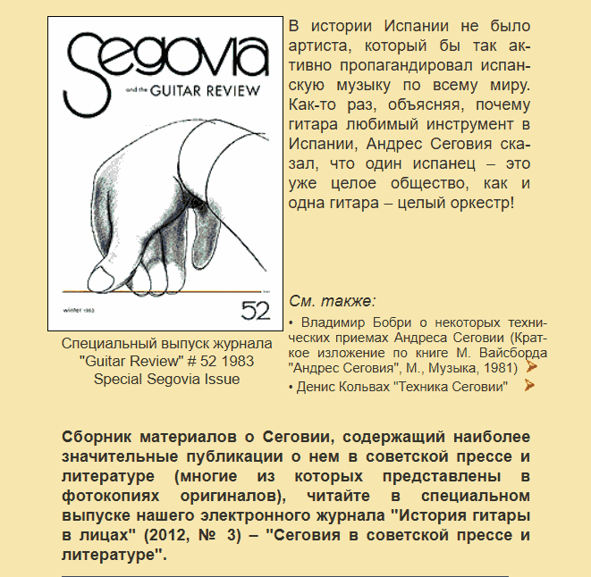
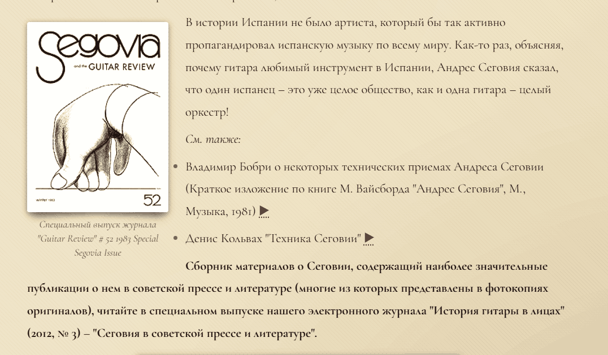

# New issues to fix

## необходимо ограничить и сузить применение 'text.list' llm hook operation. 
Случаи когда не нужно применять:
- если все строки в блоке начинаются на "*" или "**" или "***"

## пост-процессинг списков: если все строки в списке уже пронумерованы и имеют дефис: "- 01\.", "- 02\.", "- 03\.", тогда дефис перед ними избыточен и escape перед точкой не нужен: "01.", "02.", "03."
пример
сейчас:
"- 01\. (Everything I Do) I Do It For You
- 02\. Melodia
- 03\. Sacrifice
- 04\. Be
- 05\. Cry For Help
- 06\. Send Me An Angel
- 07\. Natacha
- 08\. Sound Of Silence
- 09\. Promise Me
"
Должно быть
"
01. (Everything I Do) I Do It For You
02. Melodia
03. Sacrifice
04. Be
05. Cry For Help
06. Send Me An Angel
07. Natacha
08. Sound Of Silence
09. Promise Me
"
игнорируй reference файлы. там это неправильно сделано.

## файл 'segovia'

Неправильно отображается и рендерится новый текст, что стоит за этим блоком:
"*См. также:*

- Владимир Бобри о некоторых технических приемах Андреса Сеговии (Краткое изложение по книге М. Вайсборда "Андрес Сеговия", М., Музыка, 1981) [▶](/#/bobri1)

- Денис Кольвах "Техника Сеговии" [▶](/#/segovia1)
". этот блок рендерится и отображается справа от картинки.

из-за того ,что изображение было отцентровано влево и было помещено в узкую таблицу (текстовых блока показываются справа от изображения)
вот скриншот оригинального Layout:

а вот следующий блок, начинающийся с "Сборник материалов о Сеговии" и выделенный жирным в оригинальном htm при рендеринге начинается с правой колонки, а не с новой строки,

ты должен научиться определять и научить конвертор определять такие случаи c layout и такой блок нужно начать с новой строки,
лучше всего поставить для этого разделитель страницы "---" или "***" и тогда будет так:
'''md

---

**Сборник материалов о Сеговии, содержащий наиболее значительные публикации о нем в советской прессе и литературе (многие из которых представлены в фотокопиях оригиналов), читайте в специальном выпуске нашего электронного журнала "История гитары в лицах" (2012, № 3) – "Сеговия в советской прессе и литературе".**
'''
